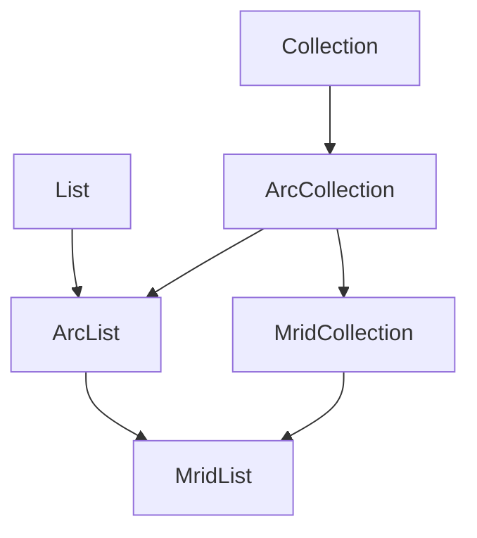

# Collection hierarchy

This package provides collection views over backing fields used by the CIM
model. Public collection capabilities are declared as interfaces under
`collections.interfaces`; storage, validation, mRID uniqueness, backfill, and
sorting are supplied by the abstract and concrete classes under `collections`.

The interface split lets CIM properties expose either collection-shaped or
list-shaped behavior without exposing the backfill owner type `O`. Italicised
class names below are structural implementation classes and are not normally
constructed directly.

## Interfaces

Note: ARC stands for Add, Remove, Clear - the only mutation methods allowed in these collections.
The full mutability of `MutableCollection` is not exposed because of the excessive amount of logic
associated with the ARC methods - functionality like `addAll` would create ambiguity and is thus left
up to the user.



`MridList<T>` is the intersection of the two capability branches: it has mRID
lookup from `MridCollection<T>` and indexed, read-only list access from
`ArcList<T>`. None of the public interfaces carries the implementation-only
backfill owner type `O`.

| Interface | Source | Adds |
|---|---|---|
| `ArcCollection<T>` | [interfaces/ArcCollection.kt](./interfaces/ArcCollection.kt) | `add`, `remove`, and `clear` over Kotlin's read-only `Collection<T>` |
| `ArcList<T>` | [interfaces/ArcList.kt](./interfaces/ArcList.kt) | Read-only `List<T>` access in addition to the ARC mutations |
| `MridCollection<T>` | [interfaces/MridCollection.kt](./interfaces/MridCollection.kt) | `getByMrid` and string-index lookup for `Identifiable` elements |
| `MridList<T>` | [interfaces/MridList.kt](./interfaces/MridList.kt) | Combines `MridCollection<T>` and `ArcList<T>` |

The implementation source for each interface begins at the following class:

```text
ArcCollection<T>   <- AbstractBackedCollection<T>
ArcList<T>         <- AbstractBackedList<T>
MridCollection<T>  <- AbstractMridCollection<T, O>
MridList<T>        <- AbstractMridList<T, O>
```

`AbstractMridList` also inherits the `MridCollection` implementation through
`AbstractMridCollection`; it does not duplicate the mRID lifecycle.

## Implementation classes

The class sources are:

- *[AbstractBackedCollection](#abstract-backed-collection)*
  ([code](./AbstractBackedCollection.kt))
  - *[AbstractBackedList](#abstract-backed-list)*
    ([code](./AbstractBackedList.kt))
    - [LazyList](#lazy-list) ([code](./LazyList.kt))
      - [LazyIndexList](#lazy-index-list) ([code](./LazyIndexList.kt))
- *[AbstractMridCollection](#abstract-mrid-collection)*
  ([code](./AbstractMridCollection.kt))
  - *[AbstractMridList](#abstract-mrid-list)*
    ([code](./AbstractMridList.kt))
    - [LazyMridList](#lazy-mrid-list) ([code](./LazyMridList.kt))
    - [BackedMridList](#backed-mrid-list) ([code](./BackedMridList.kt))
  - [LazyMridMap](#lazy-mrid-map) ([code](./LazyMridMap.kt))

## Public exposure

CIM properties should normally be typed by capability rather than by storage:

- use `ArcCollection<T>` for ARC mutation without indexing or mRID lookup;
- use `ArcList<T>` when indexed reads must remain visible;
- use `MridCollection<T>` for mRID-aware relationships without a list
  contract; and
- use `MridList<T>` when the relationship is both mRID-aware and list-shaped.

The concrete getter may still construct `LazyMridList<T, O>`,
`BackedMridList<T, O>`, or `LazyMridMap<T, O>`. Constructor inference obtains
`O` from the owner/backfill arguments, while the public interface hides it.

<a id="abstract-backed-collection"></a>

## Implementation classes

These are all the options you have of implementing collections in a CIM class.
Which exact class to chose depends on the desired memory layout, eg lists vs
nullable lists vs nullable maps.

### LazyList

Adapts a nullable mutable-list field. A `null` field is observed as an empty
list, storage is created on the first addition, and the field returns to `null`
when the collection becomes empty.

<a id="lazy-index-list"></a>

### LazyIndexList

Extends `LazyList` with explicit indexed insertion and removal without
implementing `MutableList`. Its inherited `subList` is a read-only backed view,
with the usual unspecified behavior after structural changes to the base list.

<a id="abstract-mrid-collection"></a>

### LazyMridList

Stores mRID-identified elements in a nullable list while supporting typed
backfill, validation, lookup, and optional sorting. It creates backing storage
on first addition and resets it to `null` after the final removal or a clear.

It can be exposed as either `MridCollection<T>` or `MridList<T>`, depending on
whether a particular CIM property promises indexed access.

<a id="backed-mrid-list"></a>

### BackedMridList

Stores mRID-identified elements in a non-null mutable list. It provides the
same lookup, uniqueness, backfill, validation, sorting, and `MridList<T>`
capabilities as `LazyMridList`, but retains an empty backing list after
clearing.

<a id="lazy-mrid-map"></a>

### LazyMridMap

Stores elements in a nullable map keyed by mRID and exposes the map values as
a `MridCollection<T>`. It uses identity-aware membership and removal, does not
implement `MridList<T>`, and resets the backing map to `null` when empty.

## Abstract classes

These are the abstract classes underpinning the above implementation classes,
implementing shared functionality. *Do not use these classes* unless you are
implementing new collections in this package.

### AbstractBackedCollection

Implements the narrow `ArcCollection` contract for contents stored elsewhere.
It exposes add, remove, and clear mutation, returns a read-only iterator, and
provides validation, storage, and post-removal cleanup hooks for specialised
branches. Its default `remove` uses the backing collection's mutable iterator;
storage-specific branches may override it when they preserve the same cleanup
lifecycle.

<a id="abstract-backed-list"></a>

### AbstractBackedList

Adds indexed reads and optional sorting to `AbstractBackedCollection`. It
implements `ArcList`, which combines the ARC operations with the indexed reads
of `List` without exposing the indexed mutation contract of `MutableList`.

<a id="lazy-list"></a>

### AbstractMridCollection

Implements the public `MridCollection<T>` interface. It adds lookup,
identity-based mRID uniqueness enforcement, and the typed owner/backfill
lifecycle for `Identifiable` elements while leaving the concrete list or map
storage strategy to subclasses.

The interface is the common public type used by collection-shaped CIM
properties. The abstract class carries owner type `O`, owns the shared mRID
and backfill mutation lifecycle, and is not intended to be the exposed
property type. Keeping `O` on the implementation class preserves typed
backfill without leaking it through `MridCollection<T>` or `MridList<T>`.

<a id="abstract-mrid-list"></a>

### AbstractMridList

Extends `AbstractMridCollection<T, O>` with the public `MridList<T>` interface
and optional sorting. It shares list delegation between nullable and non-null
list implementations while keeping owner type `O` internal to the
implementation.

<a id="lazy-mrid-list"></a>
